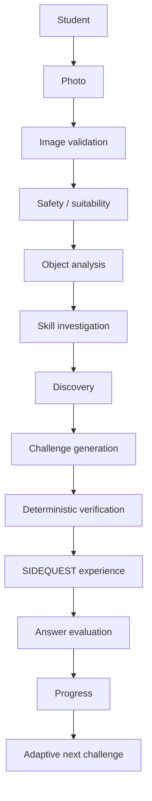

# SIDEQUEST

**Find the math hiding in your world.**

SIDEQUEST is a mobile-first learning experience for Grades 3–5. A student photographs an everyday object. Computer vision reads what is actually there. Structured AI generation writes a challenge from those properties. Application code then verifies the math before anyone sees the problem. Later Sidequests adapt from stored progress.

The photographed object has to matter. If you can swap it for any other object and the problem still works, SIDEQUEST should not have written it.

---

## Screenshots

Product screenshots are not in the repository yet. Capture them from a running build and drop them in `docs/screenshots/`:

| Screen | What to show | Suggested file |
| --- | --- | --- |
| Setup | Grade and skill selection | `docs/screenshots/setup.png` |
| Scan | Camera / photo preview | `docs/screenshots/scan.png` |
| Discover | Photograph, object name, short fact | `docs/screenshots/discover.png` |
| Connect | The real property that grounds the skill | `docs/screenshots/connect.png` |
| Challenge | The grounded problem and answer entry | `docs/screenshots/challenge.png` |
| Progress | Math Explorer Level, skills, objects found | `docs/screenshots/progress.png` |

A single hero capture of Discover or Challenge belongs at the top of this README once it exists.

---

## Why SIDEQUEST

Worksheets begin with abstract numbers. SIDEQUEST begins with something the student actually found.

```
REAL OBJECT
    → OBSERVATION
    → MATH CONNECTION
    → VERIFIED CHALLENGE
    → LEARNING PROGRESS
```

Naming the object is not enough. A problem like “Sam owns 4 soda cans and buys 3 more” does not need the photograph. A problem like “The bottle in your photo contains 11 fluid ounces. If 4 fluid ounces are poured out, how many remain?” does: the 11 came from the label. The 4 is a situation the challenge is allowed to invent.

---

## How it works

1. **Choose a mission** — pick a grade and a skill.
2. **Find an object** — a bottle, a carton, a window, a sneaker.
3. **Scan it** — take a photo or choose one you already have.
4. **Investigate** — SIDEQUEST screens the image, reads the object, and decides how that object can support the skill.
5. **Discover the hidden math** — a short fact, then the property that connects the object to the mission.
6. **Solve the Sidequest** — one grounded, grade-appropriate problem.
7. **Grow your math map** — progress updates, and the next challenge adjusts.

When the photo can become a Sidequest, that happens in one request: validate the file, screen it, store it, analyze it, investigate the skill, write a discovery, generate a candidate, and verify the math. Only a verified challenge becomes ready.

---

## The three-stage experience

A ready Sidequest reveals itself in three beats.

**Discover.** The student sees their photograph, the identified object, and one short interesting fact.

**Connect.** SIDEQUEST points at the real property that links the object to the selected skill — a printed volume, a counted row, a visible shape.

**Challenge.** One problem. The object’s property is necessary to solve it.

```
real object  →  hidden math  →  challenge
```

---

## Grounded AI, not generic word problems

SIDEQUEST separates where every number comes from:

| Origin | Meaning |
| --- | --- |
| **Observed** | Read from the photograph. |
| **Student-provided** | Collected during an investigation — a count, a measurement, a second photo. |
| **Given-in-problem** | A hypothetical the challenge introduces on purpose. |

SIDEQUEST may invent a mathematical situation. It may not invent properties of the photographed object.

**Allowed.** The bottle shows 11 fl oz. The challenge asks what remains if 4 fl oz are poured out. 11 is observed. 4 is given-in-problem, and the question has to frame it that way.

**Not allowed.** The bottle’s label is turned away, so the model “knows” soda cans are 12 oz and writes that in. That number was not in the photo.

If a challenge attributes a measurement to the object, that measurement has to have been seen.

---

## Investigation instead of rejection

An ordinary object does not need to already display every number a math problem wants. The first photograph starts the investigation. It does not have to finish it.

SIDEQUEST looks for an honest path, in this order:

1. **The photo is enough** — visible counts, a readable label, a clear geometric structure.
2. **A grounded scenario** — one real property can anchor a problem, and the rest may be hypothetical.
3. **One more look** — the object can support the skill, but SIDEQUEST still needs a count, a measurement, or a closer photo.
4. **A different trail** — only when no honest path remains.

A sneaker is a good example. Geometry can use shape and symmetry. Multiplication can use eyelets or repeated tread. Measurement can ask for heel-to-toe length or a size label. Another skill might need one extra count. The object is not useless just because the first frame has no printed number.

When the object can stay and SIDEQUEST needs one more observation, the student sees **SIDEQUEST CLUE**.

When the photo cannot be used — unclear, a poor fit for the skill, or the wrong kind of subject — the student sees **SIDEQUEST DETOUR**, with a next step rather than an internal reason code.

---

## Safety by design

SIDEQUEST is built for children.

- Image moderation runs before any educational analysis.
- A photo that does not pass is not stored, and nothing downstream sees it.
- Extremely blurry, blank, or uninterpretable photos are turned away.
- Photos of people, and private or sensitive imagery, can be refused.
- Internal moderation categories never reach the child.
- Student-facing messages stay friendly: try another object, hold still, get closer.
- If screening cannot finish, the pipeline stops. An unscreened photo is not a safe photo.

---

## Math you can trust

AI writes a candidate. Application code decides whether it is true.

The model proposes a question, a structured computation, and an answer. A TypeScript verifier then checks, independently:

- numeric validity
- unit compatibility
- arithmetic
- fractions
- conversions
- geometry
- grade appropriateness
- skill alignment
- object grounding

A challenge cannot become ready because the model says its answer is correct. The application recomputes the supported math. Natural-language solution text is checked for a simple contradiction, then ignored.

If the first candidate fails, SIDEQUEST allows one controlled regeneration. Two failures, and that photo does not become a Sidequest.

---

## Adaptive learning

Adaptation is lightweight and deterministic. It is not machine learning.

Stored skill progress and a few recent outcomes adjust:

- difficulty
- hint strength
- numeric complexity

Two rules sit above that profile:

- **Object grounding wins.** If the photograph only supports a simple problem, SIDEQUEST writes that simple problem.
- **Grade rules win.** Difficulty cannot unlock decimals, fraction denominators, conversions, or geometry the grade does not allow.

Future Sidequests get more appropriate as the student finishes them. They do not get less honest.

---

## Progress

`/progress` is the student’s math map.

- **Math Explorer Level**
- **Sidequests completed**
- **Objects discovered**
- mastery by skill

Skills:

Addition · Subtraction · Multiplication · Division · Fractions · Measurement · Geometry

Skill cards follow the profile’s current grade — Grade 3 Addition and Grade 5 Addition are different practice. Lifetime counts, such as Sidequests completed and objects discovered, can span grades.

---

## Architecture



Investigation can also pause for a **SIDEQUEST CLUE**, or send the student on a **SIDEQUEST DETOUR**. Only verification may mark a quest ready. The API response still does not include the question or the answer.

---

## Tech stack

**Frontend.** Next.js 16 (App Router), React 19, TypeScript, Tailwind CSS 4.

**AI.** OpenAI Responses API, multimodal image understanding, structured outputs, Zod validation. OpenAI moderation runs before any teaching model sees the photo.

**Backend / data.** Supabase, PostgreSQL, a private Storage bucket. Privileged access stays on the server.

**Validation / learning.** Deterministic TypeScript math evaluator, deterministic answer grading, adaptive difficulty policy.

**Deployment.** The generation route is a single synchronous request with `maxDuration` set to 300 seconds. Use a host that allows a function that long. There is no production URL in this repository.

---

## Project structure

```
app/                 Pages, layout, and the quest API
  api/quests/        Upload, screening, generation, verification
  setup/             Grade and skill
  scan/              Photograph the object
  quest/             Discover → Connect → Challenge
  progress/          Math map
components/          Student-facing UI
lib/ai/              Safety, object reading, investigation, discovery, challenge
lib/math/            Deterministic verification and answer grading
lib/progress/        Mastery, adaptation, presentation
lib/supabase/        Server client and private image signing
supabase/migrations/ Schema, skill catalogue, private image bucket
```

`lib/copy.ts` holds student-facing sentences in one place. Pipeline reason codes do not live there.

---

## Data / privacy

This is an MVP, not an enterprise privacy program.

- Students are anonymous browser profiles — an HttpOnly cookie, not a login.
- Uploaded images go to a private bucket. Display uses short-lived signed URLs minted on the server.
- Privileged database and storage work stays server-side, after an ownership check.
- Student-facing payloads are shaped on purpose. Correct answers, computations, and generation metadata stay on the server until the Sidequest is finished.
- Row Level Security is enabled on every table. The publishable key that ships in the browser cannot read student rows.

---

## Local development

```bash
git clone https://github.com/mwaywithwords/Sidequest-ai.git
cd Sidequest-ai
npm install
```

Copy `.env.example` to `.env.local` and fill in the placeholders. Never commit real secrets.

```bash
# Public — inlined into the browser at build time
NEXT_PUBLIC_SUPABASE_URL=
NEXT_PUBLIC_SUPABASE_PUBLISHABLE_KEY=

# Server-only — never import these from a Client Component
SUPABASE_SECRET_KEY=
OPENAI_API_KEY=
```

You will also need:

- a Supabase project
- the migrations in `supabase/migrations/` applied (schema, skill seed, private `sidequest-images` bucket)
- an OpenAI API key that can call the Responses API and image moderation

Then:

```bash
npm run dev
```

Open [http://localhost:3000](http://localhost:3000).

Missing public vars fail when a page first talks to Supabase. Missing server secrets fail only on the server path that reads them.

---

## Quality / verification

```bash
npm run lint
npx tsc --noEmit
npm run build
```

Deterministic suites live next to the code they cover as `*.check.ts` files. They do not call a model. There is no single `test` script yet; run a file with `npx tsx`, for example:

```bash
npx tsx lib/math/verify.check.ts
npx tsx lib/ai/challenge-grounding.check.ts
npx tsx lib/progress/adaptation.check.ts
```

---

## Current MVP limitations

- Anonymous browser profiles, not authenticated student accounts.
- The full AI pipeline runs in one request. There is no background job queue.
- SIDEQUEST CLUE can ask for one more observation, but that evidence is not yet persisted or sent back into generation.
- Adaptive learning is a small, explainable policy over stored totals — not a trained model.

These are deliberate MVP bounds, not surprises.

---

## Future directions

- Persist investigation evidence and resume generation from it
- Authenticated student profiles
- Resumable or background generation
- Broader mathematical structures
- Teacher / parent views
- Richer exploration history

---

## Project status

SIDEQUEST is an MVP / prototype. It is a working learning loop — scan, verify, solve, adapt — not a production deployment at scale.
